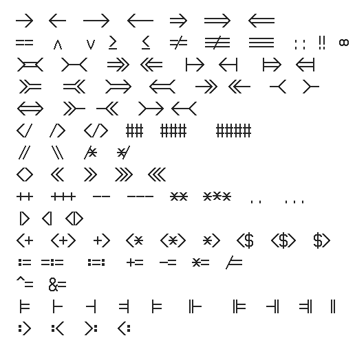
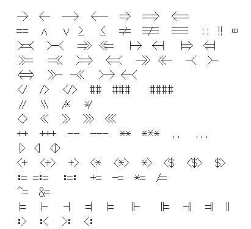

# Lerminus

This is the wonderful Terminus font created by Dimitar Toshkov Zhekov,
but with various "programming ligatures" added to the private use area
U+E000..U+EFFF. More information about Terminus is in the [original
README](./README).

There are plenty of vector fonts with coding ligatures, but I'm not
aware of any bitmap fonts with ligatures besides
[scientifica](https://github.com/NerdyPepper/scientifica).

To build Lerminus, ligatures were added to all 20 variants of
Terminus, including the lower resolution variants.

## Emacs

There isn't (as far as I know) any font-level support for ligatures in
bitmap fonts under X, but you can use `prettify-symbols-mode` and a
stanza like that in [lerminus.el](./lerminus.el) to set up the
substitutions.

## Issues

The `Makefile` doesn't work, but you can copy the various `.bdf` files
into `.local/share/fonts` or some other path where X will look for
bitmap fonts.

These `.bdf` files are no longer monospace since the ligatures are
designed to take up the width of their constituent characters.

